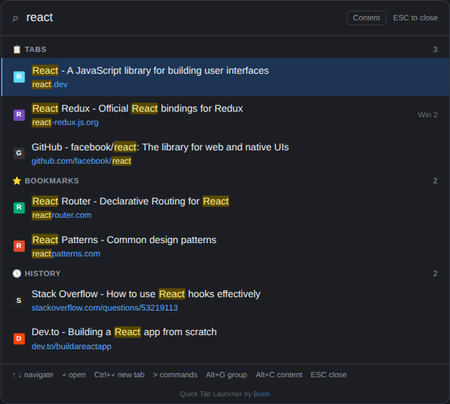
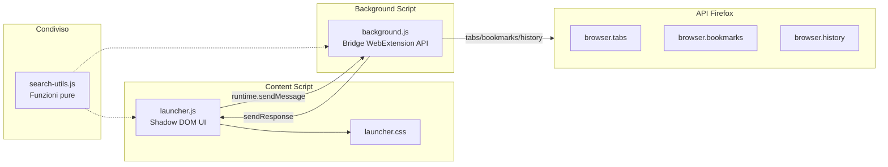
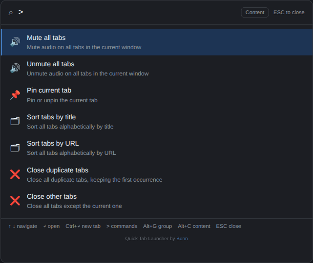
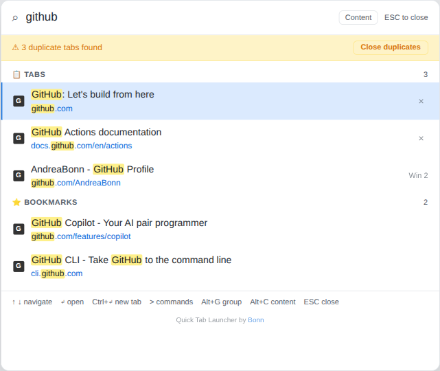

[English](./README.md) | **Italiano**

# Quick TAB Launcher by Bonn

Estensione Firefox che aggiunge una palette comandi in stile Spotlight per cercare schede aperte, segnalibri e cronologia con una scorciatoia da tastiera.

[](https://addons.mozilla.org/it/firefox/addon/quick-tab-launcher/)


<p align="center">
  
</p>

Premi `Ctrl+Shift+Space` (o clicca l'icona nella toolbar) per aprire un pannello overlay. Digita per filtrare contemporaneamente schede, segnalibri e cronologia. I risultati sono raggruppati per fonte, deduplicati e navigabili da tastiera o mouse.

## Stack tecnologico

- Vanilla JavaScript (ES2020+), nessuno step di build
- CSS puro con tema chiaro/scuro via `prefers-color-scheme`
- WebExtension Manifest V2 (Firefox 91+)
- Vitest + jsdom per i test
- ESLint (flat config) per il linting
- GitHub Actions CI (lint, test, coverage)

## Architettura



Il content script inietta un overlay Shadow DOM chiuso nella pagina attiva. L'input dell'utente invia un messaggio con debounce al background script, che interroga le API Firefox in parallelo e restituisce risultati deduplicati. `search-utils.js` viene caricato da entrambi i contesti e contiene funzioni pure (escaping, highlighting, normalizzazione URL) senza dipendenze browser.

## Struttura del repository

```text
quick-tab-launcher__firefox/
├── background/
│   └── background.js        # Chiamate WebExtension API (tabs, bookmarks, history)
├── content/
│   ├── launcher.js           # Overlay Shadow DOM (IIFE, modalita closed)
│   └── launcher.css          # Stili con supporto tema chiaro/scuro
├── src/
│   ├── search-utils.js       # Logica pura condivisa (escaping, dedup, formattazione)
│   └── config-storage.js     # Lettura/scrittura config via browser.storage.local
├── options/
│   ├── options.html          # UI pagina impostazioni
│   ├── options.js            # Logica caricamento/salvataggio/reset
│   └── options.css           # Stili pagina impostazioni (chiaro/scuro)
├── popup/
│   ├── popup.html            # Popup compatto per pagine privilegiate
│   ├── popup.js              # Logica interazione popup
│   └── popup.css             # Stili popup (chiaro/scuro)
├── icons/                    # Icone SVG (16/32/48/96)
├── tests/
│   ├── search-utils.test.js  # Test funzioni pure, nessun mock
│   ├── config-storage.test.js # Test merge e storage config
│   ├── options.test.js       # Test pagina impostazioni
│   ├── background.test.js    # Mock browser.* API via globalThis
│   └── launcher.test.js      # jsdom + Shadow DOM (forzato open per ispezione)
├── .github/workflows/
│   └── ci.yml                # Lint + test + coverage su push/PR
├── manifest.json             # Manifest estensione (MV2)
├── eslint.config.mjs         # Configurazione ESLint flat
└── vitest.config.mjs         # Vitest + jsdom + coverage v8
```

## Prerequisiti

- Firefox 91 o successivo
- Node.js 20+ (solo per lo sviluppo)

## Installazione

### Da Firefox Add-ons (consigliato)

Installa direttamente dallo [store Firefox Add-ons](https://addons.mozilla.org/it/firefox/addon/quick-tab-launcher/).

### Da sorgente (sviluppo)

1. Clona il repository
2. Installa le dipendenze di sviluppo:
   ```bash
   npm install
   ```
3. Apri Firefox e vai a `about:debugging#/runtime/this-firefox`
4. Clicca "Carica componente aggiuntivo temporaneo" e seleziona il file `manifest.json` dalla root del progetto

## Utilizzo

| Azione                          | Scorciatoia / Input                    |
| ------------------------------- | -------------------------------------- |
| Apri/chiudi il launcher         | `Ctrl+Shift+Space` o icona toolbar     |
| Naviga i risultati              | `Freccia Su` / `Freccia Giu` / `Tab`   |
| Apri il risultato selezionato   | `Enter`                                |
| Apri in nuova scheda            | `Ctrl+Enter`                           |
| Chiudi una scheda dai risultati | Clicca il pulsante X sui risultati tab |
| Chiudi il launcher              | `Escape` o clicca sullo sfondo         |

La scorciatoia da tastiera apre l'overlay a schermo intero sulle pagine normali. Sulle pagine privilegiate (`about:`, `moz-extension:`, `file:`), il click sull'icona nella toolbar apre un popup compatto con le stesse funzionalita.

<p align="center">
  
</p>

Digita `>` per accedere alla palette comandi: ordina schede, chiudi duplicati, muta/smuta, fissa e altro.

<p align="center">
  
</p>

La ricerca in segnalibri e cronologia si attiva dopo 2+ caratteri. I risultati sono limitati a 5 per categoria e deduplicati tra le fonti (le schede hanno priorita sui segnalibri, i segnalibri sulla cronologia).

La ricerca schede copre tutte le finestre aperte. Le schede provenienti da altre finestre mostrano un badge per distinguerle.

## Configurazione

Clicca col tasto destro sull'icona dell'estensione e seleziona "Opzioni" (oppure vai su `about:addons` e clicca sulle preferenze dell'estensione). Impostazioni disponibili:

| Impostazione             | Default | Descrizione                                                      |
| ------------------------ | ------- | ---------------------------------------------------------------- |
| Max risultati schede     | 5       | Numero massimo di schede aperte mostrate                         |
| Max risultati segnalibri | 5       | Numero massimo di segnalibri mostrati                            |
| Max risultati cronologia | 5       | Numero massimo di voci cronologia mostrate                       |
| Ritardo ricerca (ms)     | 80      | Attesa prima di avviare la ricerca durante la digitazione        |
| Giorni cronologia        | 30      | Quanti giorni di cronologia includere nella ricerca              |
| Lunghezza minima query   | 2       | Caratteri minimi per cercare in segnalibri e cronologia          |
| Soglia caricamento (ms)  | 300     | Attesa prima di mostrare l'indicatore di caricamento             |
| Ricerca nel contenuto    | off     | Cerca nel testo delle pagine aperte (piu lento con molte schede) |

Le impostazioni sono salvate in `browser.storage.local` e applicate in tempo reale senza ricaricare l'estensione.

Quando la ricerca nel contenuto e attiva, le schede il cui testo corrisponde alla query vengono incluse nei risultati con un badge contenuto. I match per titolo/URL appaiono sempre prima. L'estrazione del contenuto viene saltata per le pagine privilegiate dove l'iniezione di script non e consentita.

## Testing

I test girano con Vitest in ambiente jsdom:

```bash
npm test              # Esegui tutti i test
npm run test:coverage # Esegui con report coverage v8
npm run lint          # Controllo ESLint
npm run lint:fix      # Auto-fix ESLint
```

I file di test rispecchiano la struttura sorgente sotto `tests/`. `search-utils.test.js` testa funzioni pure senza mock. `background.test.js` e `launcher.test.js` simulano le API `browser.*` via `globalThis`.

## CI/CD

GitHub Actions esegue su ogni push e pull request verso `main` (`.github/workflows/ci.yml`):

1. Checkout + setup Node.js 20 con cache npm
2. `npm ci` (installazione pulita)
3. Lint (`npm run lint`)
4. Test (`npm test`)
5. Report coverage (`npm run test:coverage`)

## Sicurezza

L'estensione gira interamente lato client nella sandbox WebExtension di Firefox. L'input visualizzato nell'overlay viene sanitizzato tramite `escapeHtml()` per prevenire XSS. La UI e isolata dalla pagina host attraverso un Shadow DOM chiuso.

Il manifest dichiara il permesso `<all_urls>` perche il content script (la UI overlay) deve poter essere iniettato su qualsiasi pagina visitata dall'utente. Questo e il pattern standard per estensioni di tipo Spotlight; senza di esso il launcher funzionerebbe solo su un insieme predefinito di domini.

Per segnalare una vulnerabilita, consulta [SECURITY.it.md](./SECURITY.it.md).

## Licenza

Rilasciato sotto Apache License 2.0. Vedi [LICENSE](./LICENSE).

## Supporta il progetto

Se questa estensione ti e stata utile, lascia una stella su GitHub.
