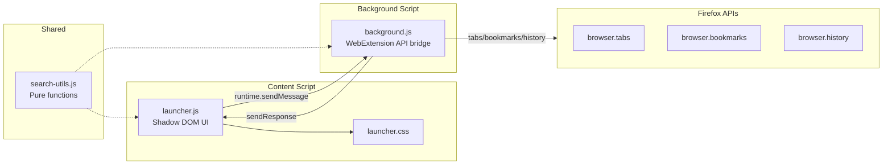

**English** | [Italiano](./README.it.md)

# Quick TAB Launcher by Bonn

A Firefox extension that adds a Spotlight-style command palette for searching open tabs, bookmarks, and browsing history from a single keyboard shortcut.


<p align="center">
  
</p>

Type `Ctrl+Shift+Space` (or click the toolbar icon) to open an overlay panel. Start typing to filter across tabs, bookmarks, and history simultaneously. Results are grouped by source, deduplicated, and navigable with keyboard or mouse.

## Tech stack

- Vanilla JavaScript (ES2020+), no build step
- Pure CSS with light/dark mode via `prefers-color-scheme`
- WebExtension Manifest V2 (Firefox 91+)
- Vitest + jsdom for testing
- ESLint (flat config) for linting
- GitHub Actions CI (lint, test, coverage)

## Architecture



The content script injects a closed Shadow DOM overlay into the active page. User input triggers a debounced message to the background script, which queries Firefox APIs in parallel and returns deduplicated results. `search-utils.js` is loaded by both contexts and contains pure functions (escaping, highlighting, URL normalization) with zero browser dependencies.

## Repository structure

```text
quick-tab-launcher__firefox/
├── background/
│   └── background.js        # WebExtension API calls (tabs, bookmarks, history)
├── content/
│   ├── launcher.js           # Shadow DOM overlay UI (IIFE, closed mode)
│   └── launcher.css          # Styles with light/dark theme support
├── src/
│   ├── search-utils.js       # Pure shared logic (escaping, dedup, formatting)
│   └── config-storage.js     # Config read/write via browser.storage.local
├── options/
│   ├── options.html          # Settings page UI
│   ├── options.js            # Settings load/save/reset logic
│   └── options.css           # Settings page styles (light/dark)
├── popup/
│   ├── popup.html            # Compact popup fallback for privileged pages
│   ├── popup.js              # Popup interaction logic
│   └── popup.css             # Popup styles (light/dark)
├── icons/                    # SVG icons (16/32/48/96)
├── tests/
│   ├── search-utils.test.js  # Pure function tests, no mocks
│   ├── config-storage.test.js # Config merge and storage tests
│   ├── options.test.js       # Settings page tests
│   ├── background.test.js    # browser.* API mocks via globalThis
│   └── launcher.test.js      # jsdom + Shadow DOM (forced open for inspection)
├── .github/workflows/
│   └── ci.yml                # Lint + test + coverage on push/PR
├── manifest.json             # Extension manifest (MV2)
├── eslint.config.mjs         # ESLint flat config
└── vitest.config.mjs         # Vitest + jsdom + v8 coverage
```

## Prerequisites

- Firefox 91 or later
- Node.js 20+ (for development only)

## Installation

### From source (development)

1. Clone the repository
2. Install development dependencies:
   ```bash
   npm install
   ```
3. Open Firefox and navigate to `about:debugging#/runtime/this-firefox`
4. Click "Load Temporary Add-on" and select the `manifest.json` file from the project root

### As a permanent extension

Package the extension into an `.xpi` file and install it through Firefox Add-ons. The extension requires the following permissions: tabs, bookmarks, history, activeTab, storage.

## Usage

| Action                   | Shortcut / Input                   |
| ------------------------ | ---------------------------------- |
| Open/close the launcher  | `Ctrl+Shift+Space` or toolbar icon |
| Navigate results         | `Arrow Up` / `Arrow Down` / `Tab`  |
| Open selected result     | `Enter`                            |
| Open in new tab          | `Ctrl+Enter`                       |
| Close a tab from results | Click the X button on tab results  |
| Dismiss the launcher     | `Escape` or click the backdrop     |

The keyboard shortcut opens the full-screen overlay on regular pages. On privileged pages (`about:`, `moz-extension:`, `file:`), clicking the toolbar icon opens a compact popup fallback with identical functionality.

<p align="center">
  
</p>

Type `>` to access the command palette: sort tabs, close duplicates, mute/unmute, pin, and more.

<p align="center">
  
</p>

Bookmarks and history search activate after 2+ characters. Results are capped at 5 per category and deduplicated across sources (tabs take priority over bookmarks, bookmarks over history).

Tab search spans all open windows. Tabs from other windows display a badge to distinguish them from the current window.

## Configuration

Right-click the extension icon and select "Options" (or go to `about:addons` and click the extension's preferences). Available settings:

| Setting                | Default | Description                                                     |
| ---------------------- | ------- | --------------------------------------------------------------- |
| Max tab results        | 5       | Maximum number of open tabs shown                               |
| Max bookmark results   | 5       | Maximum number of bookmarks shown                               |
| Max history results    | 5       | Maximum number of history entries shown                         |
| Search debounce (ms)   | 80      | Delay before triggering search while typing                     |
| History days           | 30      | How many days of browsing history to search                     |
| Min query length       | 2       | Minimum characters to search bookmarks/history                  |
| Loading threshold (ms) | 300     | Delay before showing the loading indicator                      |
| Full-text search       | off     | Search within page content of open tabs (slower with many tabs) |

Settings are persisted in `browser.storage.local` and applied in real-time without reloading the extension.

When full-text search is enabled, tabs whose page content matches the query are included in results with a content badge. Title/URL matches always appear first. Content extraction is skipped for privileged pages where script injection is not allowed.

## Testing

Tests run with Vitest in a jsdom environment:

```bash
npm test              # Run all tests
npm run test:coverage # Run with v8 coverage report
npm run lint          # ESLint check
npm run lint:fix      # ESLint auto-fix
```

Test files mirror the source structure under `tests/`. `search-utils.test.js` tests pure functions without mocks. `background.test.js` and `launcher.test.js` mock `browser.*` APIs via `globalThis`.

## CI/CD

GitHub Actions runs on every push and pull request to `main` (`.github/workflows/ci.yml`):

1. Checkout + Node.js 20 setup with npm cache
2. `npm ci` (clean install)
3. Lint (`npm run lint`)
4. Test (`npm test`)
5. Coverage report (`npm run test:coverage`)

## Security

The extension runs entirely client-side within Firefox's WebExtension sandbox. Input displayed in the overlay is escaped via `escapeHtml()` to prevent XSS. The UI is isolated from the host page through a closed Shadow DOM.

The manifest declares the `<all_urls>` permission because the content script (the overlay UI) must be injectable on any page the user visits. This is the standard pattern for Spotlight-style extensions; without it, the launcher would only work on a pre-defined set of domains.

To report a vulnerability, see [SECURITY.md](./SECURITY.md).

## License

Released under the Apache License 2.0. See [LICENSE](./LICENSE).

## Support the project

If you found this extension useful, consider giving it a star on GitHub.
